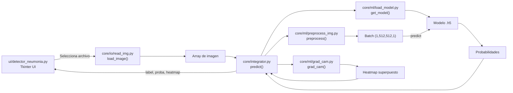

# Diseño del sistema (UAO-Neumonia)

## Objetivo

El sistema permite cargar una radiografía de tórax (DICOM/JPG/PNG), procesarla y clasificarla en tres clases (neumonía bacteriana, neumonía viral o normal). Adicionalmente genera una explicación visual tipo **Grad-CAM** que resalta regiones relevantes de la imagen.

## Arquitectura

El proyecto está organizado con un layout `src/` y un paquete principal `uao_neumonia`.

### Capas / módulos

- **UI (`src/uao_neumonia/ui/`)**
  - `detector_neumonia.py`: interfaz gráfica Tkinter. Controla la interacción con el usuario.

- **Orquestación (`src/uao_neumonia/core/`)**
  - `integrator.py`: función `predict(array)` que coordina el flujo completo (preprocesamiento, predicción y Grad-CAM) y retorna solo lo necesario para la UI.

- **Entrada de datos (`src/uao_neumonia/core/io/`)**
  - `read_img.py`: lectura de imágenes desde archivo (DICOM y formatos comunes), retornando un arreglo listo para procesar y una representación para visualizar.

- **ML / Visión (`src/uao_neumonia/core/ml/`)**
  - `preprocess_img.py`: `preprocess(array)` prepara la imagen para el modelo (resize, escala de grises, CLAHE, normalización y batch).
  - `load_model.py`: `get_model()` carga el modelo `.h5` desde `model/` y mantiene caché en memoria.
  - `grad_cam.py`: `grad_cam(array, model=...)` calcula el mapa de calor Grad-CAM y retorna una imagen superpuesta.

- **Utilidades (`src/uao_neumonia/utils/`)**
  - `paths.py`: utilidades de rutas (por ejemplo `repo_root()`), usadas para ubicar la carpeta `model/`.

## Flujo principal

1. La UI solicita al usuario una imagen.
2. `read_img.load_image()` carga la imagen y la convierte a un arreglo.
3. `integrator.predict()` orquesta:
   - `preprocess()` para preparar la entrada.
   - `get_model()` para cargar el modelo.
   - `model.predict()` para obtener probabilidades.
   - `grad_cam()` para explicar la predicción.
4. La UI muestra:
   - etiqueta predicha
   - probabilidad
   - imagen con heatmap

## Diagrama (Mermaid)

## Ejecución

- Entry point:
  - `python -m uao_neumonia`
  - o comando de consola: `uao-neumonia`
